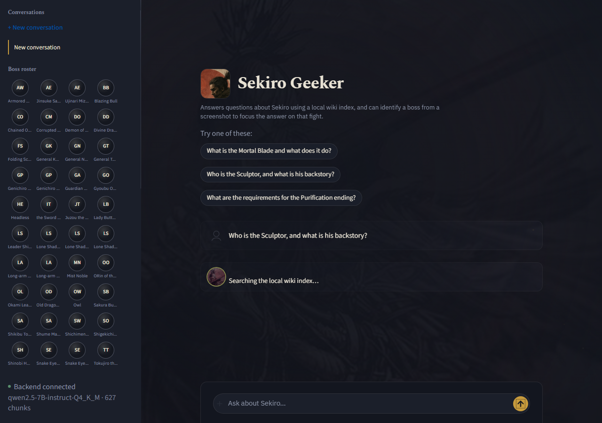

# Sekiro Lore & Wiki RAG Assistant

A retrieval-augmented chatbot that answers questions about *Sekiro: Shadows Die Twice* using
only an indexed corpus of the game's wiki. Every answer cites the pages it came from.


Asked without retrieval, the same question invents an "Ashina Blade" and a betrayal that never
happened. With retrieval, the citations point at the real page. See [Evaluation](#evaluation).

| Track | What it does | Status |
|---|---|---|
| **Core** | Wiki RAG pipeline — ingest, chunk, embed, retrieve, generate, cite | ✅ complete |
| **Extended** | Boss detection from screenshots, biases retrieval toward the detected boss | ✅ fine-tuned, weights ship with the repo |

---

## Architecture

The backend loads every heavyweight dependency **once at startup** (FastAPI `lifespan`) and
reuses it per request — nothing is rebuilt on the fly.

```
                 ┌────────────────────────┐
                 │   Streamlit frontend    │  reads API_BASE_URL from env
                 └───────────┬────────────┘
                             │ HTTP
                 ┌───────────▼────────────┐
                 │    FastAPI backend      │
                 └──┬──────────┬────────┬──┘
                    │          │        │
      ┌─────────────▼──┐  ┌────▼─────┐ ┌▼────────────────┐
      │RetrievalService │  │Generation│ │DetectionService  │
      │ MiniLM + Chroma │  │  Ollama  │ │ YOLO (optional)  │
      └────────┬────────┘  └──────────┘ └──────────────────┘
      ┌────────▼─────────┐
      │ 627 chunks from  │
      │ 172 wiki pages   │
      └──────────────────┘
```

Offline indexing (run once, in the notebook): raw wikitext → clean → section-chunk (~400
tokens, ~75 overlap) → tag boss chunks with their YOLO class → embed (`all-MiniLM-L6-v2`) →
persist to ChromaDB.

---

## Tech stack

| Layer | Choice | Why |
|---|---|---|
| Embeddings | `all-MiniLM-L6-v2` | 384-dim, fast on CPU, strong on short passages |
| Vector store | ChromaDB (persistent, cosine) | Zero-infra local persistence + metadata filtering |
| LLM | Ollama, `qwen2.5-7B-instruct` Q4_K_M | Fully local, no API key, swappable via env var |
| Backend | FastAPI + Uvicorn | Async, typed schemas, lifespan hooks |
| Frontend | Streamlit | Single-file chat UI, no build step |
| Detection | Ultralytics YOLOv8n (optional) | Extended Track — fine-tuned on 5 boss classes |

---

## Repository structure

```
sekiro-wiki-assistant/
├── notebooks/               rag_pipeline.ipynb (graded), yolo_boss_detection.ipynb,
│                             wiki_preprocess.py, vector_store_export/
├── backend/app/              main.py, api/routes/query.py, services/{retrieval,generation,detection}.py
│   ├── tests/test_query.py   12 tests
│   ├── data/vector_store/    committed
│   └── data/yolo_model/best.pt   committed, ~6 MB
├── frontend/app.py           chat UI + api_client.py + assets/
├── docs/screenshots/
├── data/raw/raw_wiki/        219 source .txt files (not committed)
├── data/images/              raw footage + dataset exports (not committed)
└── runs/                     [Extended] training output (not committed)
```

---

## Domain and data

219 wikitext pages scraped from the [Sekiro Fandom wiki](https://sekiro-shadows-die-twice.fandom.com/wiki/Sekiro:_Shadows_Die_Twice_Wiki)
as raw MediaWiki source. 46 were redirects and skipped, leaving 172 indexed pages and 627
chunks (400/75 tokens, min 40). Covers bosses, endings, items, prosthetics, combat arts, NPCs,
locations and lore. Full per-page breakdown: [`CORPUS.md`](CORPUS.md).

Boss-page chunks are tagged with the matching YOLO class name so retrieval can be filtered to
the boss on screen example:

| Class | Tagged chunks |
|---|---|
| `corrupted_monk` | 20 |
| `divine_dragon` | 5 |
| `genichiro` | 18 |
| `guardian_ape` | 12 |
| `owl` | 26 |

---

## Extended Track: dataset preparation

Building the boss-detection training set went through five stages, in this order.

**1. Slicing.** Source footage: `videoplayback.mp4`, 1920×1080, 60 fps, ~98 minutes, one
continuous play session. Frames were extracted at 4 fps and cropped to the game viewport
(removing the stream overlay), producing 1,471 frames across seven boss encounters.

**2. Boss selection.** A pre-existing 40-class Roboflow export was available, but only 7 of
those 40 classes had the 60+ images the spec requires — the rest averaged single digits.
Training all 40 would have produced 40 under-taught classes rather than a working detector, so
the set was narrowed to **5 visually distinct bosses** with enough data to actually learn:
`corrupted_monk`, `divine_dragon`, `genichiro`, `guardian_ape`, `owl`.

**3. Cleaning.** Menus, loading screens, and blurry frames were dropped from the 1,471 sliced
frames, leaving 1,419 usable. Frames whose only boss was outside the chosen 5 were also
dropped rather than kept as background — otherwise the model would learn to suppress a real
boss it just wasn't trained to name. An evenly spaced selection across each encounter then
produced 275 frames for hand-labelling, so poses vary instead of clustering around one moment.

**4. Balancing.** The pre-existing export was heavily skewed (129:1 between the largest and
smallest class). Merging in the 275 newly labelled frames — 128 of which got hand-drawn boxes
after auto-labelling (interpolation, optical-flow tracking) measured too poorly to trust (mean
IoU 0.34–0.46 against a 0.43 ceiling) — brought the imbalance down to 3.4:1:

| split | images | boxes |
|---|---|---|
| train | 725 | 603 |
| valid | 108 | 95 |
| test | 38 | 32 |

Per-class instances example: `owl` 317, `genichiro` 119, `corrupted_monk` 104, `guardian_ape` 97,
`divine_dragon` 93.

**5. Labelling.** Boxes were drawn by hand with a local tkinter tool
(`_yolo_rebuild/label_tool.py`) that writes YOLO `.txt` on mouse release. Each box was
validated (correct class id, five fields, no degenerate or out-of-frame boxes) before being
merged into the final dataset above.

**Known limitation:** the hand-drawn labels all come from the single session in step 1, so
`corrupted_monk` and `divine_dragon` clear the *count* floor but not a *two-session* diversity
bar — untested against a different playthrough. A second recording session is the fix, and the
pipeline (`extract_frames.py` → `select_to_label.py` → `label_tool.py` → `build_dataset.py` →
retrain) takes one without changes.

the dataset is on :https://universe.roboflow.com/mostafa-osman-36d4i/sekiro-boss-detection-cap-40

---

## Training & evaluation (Extended Track)

Fine-tuned from pretrained `yolov8n.pt`, 100 epochs (patience 25), imgsz 640, batch 8, RTX 3050
Ti (4GB). Early-stopped at epoch 53; best checkpoint epoch 28.

| Split | Precision | Recall | mAP50 | mAP50-95 |
|---|---|---|---|---|
| test (clean holdout) | 0.548 | 0.733 | 0.701 | 0.357 |
| valid (early-stop signal) | 0.793 | 0.686 | 0.742 | 0.385 |

`owl` is the strongest class (mAP50 0.91, several hundred instances); `divine_dragon` the
weakest (mAP50 0.65), consistent with its single-session limitation. The confidence threshold
is set to **0.50**, not the F1-optimal 0.35, because a missed detection safely falls back to
unfiltered retrieval while a wrong detection would confidently apply the wrong boss filter —
the two error types aren't equally costly here. At 0.50: 82% of applied filters are correct,
61% of bosses are caught.

A silent trap worth knowing: Ultralytics reads a raw numpy array as BGR and a PIL image as RGB.
Passing a numpy array of an RGB image silently swaps red/blue and can flip the predicted class
with no error — confirmed on a held-out dragon frame (PIL → `divine_dragon` 0.68; numpy → `owl`
0.35). `DetectionService.detect()` passes the PIL image directly.

Full per-class tables, the confidence sweep, and the BGR investigation are in
`notebooks/yolo_boss_detection.ipynb`.

---

## RAG evaluation

Ten spec questions (three deliberately obscure) were run end to end.

| Kind | Result |
|---|---|
| Well-known (7) | 5 correct, 2 refused despite the answer being in context (generation-side misses, not retrieval failures) |
| Obscure (3) | 3/3 correct |
| Corpus gap (1 of the well-known 7) | Correctly refused — no page on "Dragon's Heritage" exists in the scrape |

**The grounding proof:** the same three obscure questions, asked with no retrieved context,
make up a different game's lore — Kuro becomes a "dog companion," the Sculptor gets an invented
"Ashina Blade" and clan betrayal, Emma becomes "Genichiro's wife." None of it is in the corpus,
all of it stated with full confidence, and it isn't even stable across runs. That instability is
the strongest argument for grounding: there's no memorized answer to fall back on, so without
the corpus the model just invents one.

Full question-by-question transcripts and the two generation-side failure cases are in
`notebooks/rag_pipeline.ipynb`, section 5.6.

---

## Setup

```bash
# Prerequisites: Python 3.12+, Ollama running
ollama pull qcwind/qwen2.5-7B-instruct-Q4_K_M

# Backend
cd backend
python -m venv .venv && . .venv/Scripts/activate
pip install -r requirements.txt
cp .env.example .env
uvicorn app.main:app --reload --port 8000

# Frontend (new terminal)
cd frontend
pip install -r requirements.txt
cp .env.example .env
streamlit run app.py   # open http://localhost:8501

# Tests
cd backend && pytest -v
```

The vector store is committed at `backend/data/vector_store/`; regenerate it by running
`notebooks/rag_pipeline.ipynb` and copying `notebooks/vector_store_export/` over it.

Boss detection is **optional and non-fatal** — no weights, no `ultralytics`, no problem;
`/health` reports it disabled and the Core Track keeps serving. Comment out `YOLO_MODEL_PATH`
in `.env` to run Core-only.

**Docker (backend only):**
```bash
docker build -f backend/Dockerfile -t sekiro-rag-backend .
docker run --rm -p 8000:8000 --add-host=host.docker.internal:host-gateway \
  -e OLLAMA_HOST=http://host.docker.internal:11434 sekiro-rag-backend
```

---

## Environment variables

| Variable | Default | Purpose |
|---|---|---|
| `OLLAMA_MODEL` | `qcwind/qwen2.5-7B-instruct-Q4_K_M` | Any instruct model works |
| `OLLAMA_HOST` | `http://localhost:11434` | Ollama endpoint |
| `VECTOR_STORE_PATH` | `./data/vector_store` | Persisted Chroma directory |
| `EMBEDDING_MODEL` | `all-MiniLM-L6-v2` | Must match the notebook's model |
| `TOP_K` | `4` | Chunks retrieved per query |
| `YOLO_MODEL_PATH` | `./data/yolo_model/best.pt` | Unset disables detection |
| `YOLO_CONFIDENCE_THRESHOLD` | `0.5` | Measured, not a default — see above |
| `API_BASE_URL` (frontend) | `http://localhost:8000` | Read from env, never hard-coded |

---

## API reference

**`GET /health`** — readiness of each dependency; returns `200` even when detection is degraded.

**`POST /query`**
```bash
curl -X POST http://localhost:8000/query \
  -H "Content-Type: application/json" \
  -d '{"question": "What does the Mortal Blade do?"}'
```
→ `{"answer": "...", "sources": [...], "detection": null}`

`422` invalid question · `502` LLM unreachable · `503` empty retrieval.

**`POST /query-image`** (Extended Track) — same as `/query`, plus a screenshot. A detection at
or above `YOLO_CONFIDENCE_THRESHOLD` filters retrieval to that boss, topping up with unfiltered
results if the filter alone would return fewer than `TOP_K` chunks. Detection is always reported
in the response, including a below-threshold miss (`used_for_retrieval: false`).

---

## Screenshots


The left rail (Conversations, Boss roster, status footer) is custom markup, not Streamlit's
sidebar — nothing about it round-trips through Python, so switching conversations never
flashes or reloads the page.



Regenerate both with `python docs/capture_screenshots.py` (needs `playwright`, not in either
`requirements.txt` — a docs-only tool).

---

## License and attribution

Game content is © FromSoftware / Activision. Wiki text is community-authored on Fandom under
CC BY-SA. This project is an academic exercise and claims no ownership over either.
