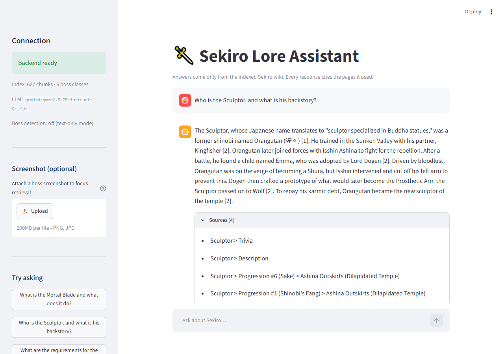
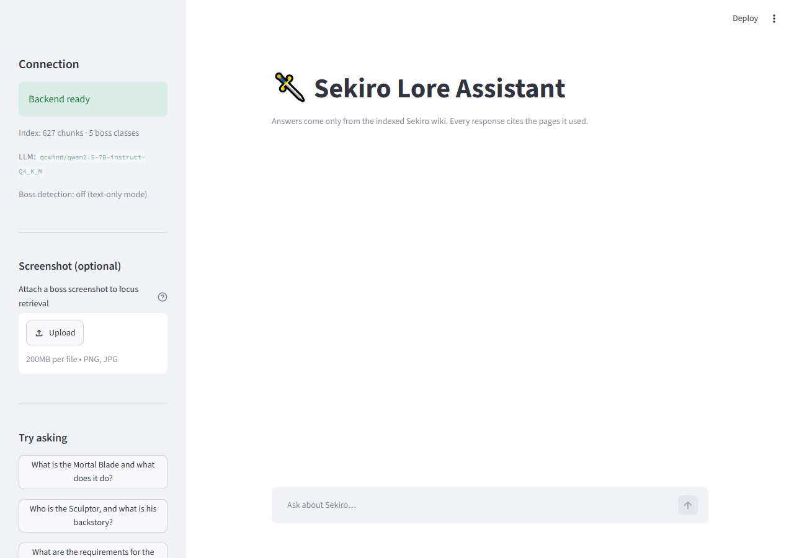

# Sekiro Lore & Wiki RAG Assistant

A retrieval-augmented chatbot that answers questions about *Sekiro: Shadows Die Twice* using
only an indexed corpus of the game's wiki. Every answer cites the pages it came from.



The question above is one of the three deliberately obscure evaluation questions. The model
answers it from `Sculptor > Trivia` and `Sculptor > Description` and nothing else — with the
same question asked without retrieval, it invents an "Ashina Blade" and a betrayal that never
happened. See [Evaluation](#evaluation).

The project has two tracks:

| Track | What it does | Status |
|---|---|---|
| **Core** | Wiki RAG pipeline — ingest, chunk, embed, retrieve, generate, cite | ✅ complete |
| **Extended** | Boss detection from screenshots, used to bias retrieval toward the detected boss | 🚧 detector optional; API path built and tested |

---

## Architecture

The backend loads every heavyweight dependency **once at startup** (FastAPI `lifespan`) and
stashes it on `app.state`. Nothing is rebuilt per request.

```
                 ┌────────────────────────┐
                 │   Streamlit frontend    │  reads API_BASE_URL from env
                 │  chat UI + citations    │  (never hard-coded)
                 └───────────┬────────────┘
                             │ HTTP
                 ┌───────────▼────────────┐
                 │    FastAPI backend      │
                 │  lifespan: load once    │
                 └──┬──────────┬────────┬──┘
                    │          │        │
      ┌─────────────▼──┐  ┌────▼─────┐ ┌▼────────────────┐
      │RetrievalService │  │Generation│ │DetectionService  │
      │ MiniLM + Chroma │  │ Service  │ │ YOLO (optional)  │
      └────────┬────────┘  │  Ollama  │ └──────────────────┘
               │           └──────────┘
      ┌────────▼─────────┐
      │ 627 chunks from  │
      │ 172 wiki pages   │
      └──────────────────┘
```

Offline indexing pipeline (run once, in the notebook):

```
219 raw wikitext files
   → clean_wikitext()      strip templates/tables/markup, keep prose
   → section chunking      split on wiki subheadings, ~400 tokens, ~75 overlap
   → boss tagging          attach YOLO class name where the page is a boss page
   → all-MiniLM-L6-v2      384-dim, L2-normalised
   → ChromaDB              persisted to disk (cosine space)
```

---

## Tech stack

| Layer | Choice | Why |
|---|---|---|
| Embeddings | `sentence-transformers` / `all-MiniLM-L6-v2` | 384-dim, fast on CPU, strong on short passages |
| Vector store | ChromaDB (persistent, cosine) | Zero-infra local persistence + metadata filtering |
| LLM | Ollama (`qwen2.5-7B-instruct` Q4_K_M) | Fully local, no API key, swappable via env var |
| Backend | FastAPI + Uvicorn | Async, typed Pydantic schemas, lifespan hooks |
| Frontend | Streamlit | Chat UI in ~200 lines |
| Detection | Ultralytics YOLO (optional) | Extended Track only |

---

## Repository structure

```
sekiro-wiki-assistant/
├── notebooks/
│   ├── rag_pipeline.ipynb      ← graded deliverable, runs top-to-bottom
│   ├── wiki_preprocess.py      ← cleaning + chunking module (imported by notebook)
│   ├── vector_store_export/    ← Chroma index written by the notebook (build artifact)
│   ├── eval_retrieval.json     ← measured retrieval results
│   └── measure_retrieval.py    ← harness that produced eval_retrieval.json
├── backend/
│   ├── app/
│   │   ├── main.py             ← FastAPI app + lifespan
│   │   ├── core/config.py      ← pydantic-settings
│   │   ├── api/routes/query.py ← /health, /query, /query-image
│   │   ├── schemas/query.py    ← request/response models
│   │   ├── services/
│   │   │   ├── retrieval.py
│   │   │   ├── generation.py   ← documents the 5.5.8 filter rule
│   │   │   └── detection.py    ← optional, never fatal
│   │   └── utils/logging_config.py
│   ├── tests/test_query.py     ← 12 tests
│   ├── data/vector_store/      ← runtime index
│   ├── Dockerfile
│   └── requirements.txt
├── frontend/
│   ├── app.py                  ← Streamlit chat UI
│   ├── api_client.py           ← HTTP wrapper
│   └── requirements.txt
├── docs/
│   ├── capture_screenshots.py  ← regenerates the screenshots below
│   └── screenshots/
├── data/
│   ├── raw/raw_wiki/           ← 219 source .txt files (NOT committed)
│   └── images/                 ← screenshot frames + YOLO dataset (NOT committed)
└── .gitignore
```

---

## Domain and data

**Corpus.** 219 wikitext pages scraped from the
[Sekiro: Shadows Die Twice Fandom wiki](https://sekiro-shadows-die-twice.fandom.com/wiki/Sekiro:_Shadows_Die_Twice_Wiki),
saved as raw MediaWiki source (`?action=raw`) under `data/raw/raw_wiki/`.

| Metric | Value |
|---|---|
| Raw files | 219 |
| Pages indexed | 172 |
| Redirects skipped | 46 |
| Chunks produced | 627 |
| Chunk size / overlap | 400 / 75 tokens (min 40) |
| Embedding dim | 384 |

The corpus covers bosses, endings, items, prosthetic tools, combat arts, NPCs, locations and
lore. Representative pages: `Genichiro_Ashina`, `Guardian_Ape`, `Divine_Dragon`,
`Great_Shinobi_-_Owl`, `Corrupted_Monk`, `Mortal_Blade`, `Kuro,_The_Divine_Heir`,
`Sculptor`, `Emma`, `Ending_1-_Shura` … `Ending_4-_Return`.

**The full list of all 172 indexed pages, with per-page chunk counts, boss class assignments
and a direct source URL for each, is in [`CORPUS.md`](CORPUS.md)** — generated from the index
by `notebooks/build_corpus_index.py`, so it reflects what was actually embedded.

Source URL pattern: `https://sekiro-shadows-die-twice.fandom.com/wiki/<Page_Name>?action=raw`

**Boss classes.** Chunks whose page belongs to a boss are tagged with the YOLO class name so
retrieval can be filtered by detected boss. Class names are defined once, in `BOSS_PAGES` in
the notebook, and must match the YOLO dataset's class names exactly.

| Class | Tagged chunks |
|---|---|
| `corrupted_monk` | 20 |
| `divine_dragon` | 5 |
| `genichiro` | 18 |
| `guardian_ape` | 12 |
| `owl` | 26 |

Non-boss chunks carry an empty string (Chroma metadata cannot store `None`).

---

## Setup

### 1. Prerequisites

- Python 3.12+ (developed on 3.14)
- [Ollama](https://ollama.com/download) installed and running

```bash
ollama pull qcwind/qwen2.5-7B-instruct-Q4_K_M
```

### 2. Backend

```bash
cd backend
python -m venv .venv && . .venv/Scripts/activate   # Windows
pip install -r requirements.txt
cp .env.example .env        # then edit if needed
uvicorn app.main:app --reload --port 8000
```

The vector store must exist at `VECTOR_STORE_PATH` before startup. It is committed at
`backend/data/vector_store/`; to regenerate it, run `notebooks/rag_pipeline.ipynb` and copy
`notebooks/vector_store_export/` over it.

### 3. Frontend

```bash
cd frontend
pip install -r requirements.txt
cp .env.example .env        # set API_BASE_URL if not localhost:8000
streamlit run app.py
```

Open <http://localhost:8501>.

### 4. Docker (backend only)

```bash
docker build -f backend/Dockerfile -t sekiro-rag-backend .
docker run --rm -p 8000:8000 --add-host=host.docker.internal:host-gateway \
  -e OLLAMA_HOST=http://host.docker.internal:11434 sekiro-rag-backend
```

> Inside the container `localhost` is the container, not your machine — `OLLAMA_HOST` must
> point at `host.docker.internal` when Ollama runs on the host.

### 5. Tests

```bash
cd backend && pytest -v
```

Tests run **real retrieval** against the real index but stub the LLM call, so they are
deterministic and do not require Ollama. First run takes ~1 minute (the embedding model loads).

---

## Environment variables

### Backend (`backend/.env`)

| Variable | Default | Purpose |
|---|---|---|
| `OLLAMA_MODEL` | `qcwind/qwen2.5-7B-instruct-Q4_K_M` | Exact Ollama tag. Any instruct model works |
| `OLLAMA_HOST` | `http://localhost:11434` | Ollama endpoint |
| `VECTOR_STORE_PATH` | `./data/vector_store` | Persisted Chroma directory |
| `VECTOR_STORE_COLLECTION` | `sekiro_wiki` | Collection name |
| `EMBEDDING_MODEL` | `all-MiniLM-L6-v2` | **Must match the notebook's model** |
| `TOP_K` | `4` | Chunks retrieved per query |
| `FRONTEND_ORIGIN` | `http://localhost:8501` | CORS allow-origin |
| `YOLO_MODEL_PATH` | *(unset)* | Path to fine-tuned weights; unset disables detection |
| `YOLO_CONFIDENCE_THRESHOLD` | `0.5` | Minimum confidence to trust a detection |

### Frontend (`frontend/.env`)

| Variable | Default | Purpose |
|---|---|---|
| `API_BASE_URL` | `http://localhost:8000` | Backend base URL. Read from env — **never hard-coded** |

---

## API reference

### `GET /health`

Readiness of each startup-loaded dependency. Returns `200` even when degraded.

```bash
curl http://localhost:8000/health
```

```json
{
  "status": "ok",
  "vector_store": { "loaded": true, "chunks": 627, "collection": "sekiro_wiki",
                    "boss_classes": ["corrupted_monk", "divine_dragon", "genichiro",
                                     "guardian_ape", "owl"] },
  "llm": { "available": true, "model": "qcwind/qwen2.5-7B-instruct-Q4_K_M",
           "host": "http://localhost:11434" },
  "detection": { "enabled": false, "confidence_threshold": 0.5 }
}
```

### `POST /query`

```bash
curl -X POST http://localhost:8000/query \
  -H "Content-Type: application/json" \
  -d '{"question": "What does the Mortal Blade do?"}'
```

```json
{
  "answer": "The Mortal Blade is an odachi capable of slaying the undying ...",
  "sources": ["Mortal Blade > In-Game Description", "Mortal Blade > Overview"],
  "detection": null
}
```

| Status | Meaning |
|---|---|
| `422` | Question missing, empty, whitespace-only, or over 1000 chars |
| `502` | LLM unreachable (Ollama down or model not pulled) |
| `503` | Vector store returned no results |

### `POST /query-image` *(Extended Track)*

Same as `/query`, plus a screenshot. If a boss is detected at or above the confidence
threshold, retrieval is filtered to that boss's chunks first, falling back to an unfiltered
search when the filter would return fewer than `TOP_K` results. Below the threshold — or with
detection disabled — this behaves exactly like `/query`.

```bash
curl -X POST http://localhost:8000/query-image \
  -F "question=How do I beat this boss?" \
  -F "image=@screenshot.png"
```

```json
{
  "answer": "...",
  "sources": ["Great Shinobi - Owl > Behaviour and Tactics > Phase 1"],
  "detection": { "boss": "owl", "confidence": 0.91, "used_for_retrieval": true }
}
```

`detection` is reported in every response for transparency, including when the detection was
too weak to steer retrieval (`used_for_retrieval: false`).

---

## Evaluation

Ten questions from the specification (three flagged obscure) were run through the pipeline.
Retrieval was scored on the **top-4 window**, since that is what actually reaches the LLM.

| # | Kind | Question | Top pages retrieved | Verdict |
|---|---|---|---|---|
| 1 | well-known | Who is Genichiro Ashina and what is his role in the story? | `Genichiro Ashina` | ✅ |
| 2 | well-known | What is the Dragon's Heritage, and who carries it? | `Dragon's Tally Board`, `Divine Dragon`, `Dragon Flash` | ❌ corpus gap |
| 3 | well-known | How do you defeat the Guardian Ape? | `Guardian Ape`, `Headless Ape` | ✅ |
| 4 | well-known | What happens in the Immortal Severance ending? | `Immortal Severance Scrap`, `Immortal Severance Text`, **`Ending 2- Immortal Severance`** | ✅ |
| 5 | **obscure** | What is Kuro's connection to the Dragon's Heritage? | `Kuro, The Divine Heir`, `Ending 4- Return` | ✅ |
| 6 | well-known | What does the Mortal Blade do? | `Mortal Blade`, `Mortal Draw` | ✅ |
| 7 | **obscure** | Who is the Sculptor, and what is his backstory? | `Sculptor` | ✅ |
| 8 | well-known | What is the difference between the Shura ending and the Return ending? | `Ending 1- Shura`, `Shura Storyteller`, `Ending 4- Return` | ✅ |
| 9 | well-known | What prosthetic tool is effective against Lady Butterfly? | `Lady Butterfly` | ✅ |
| 10 | **obscure** | What is Emma's role in Genichiro's story? | `Emma` | ✅ |

**Top-4 page coverage: 9/9 scoreable questions.**

### Generated answers

All ten questions were then answered by `qwen2.5-7B-instruct` (Q4_K_M) through the grounded
prompt — retrieved context only, `temperature=0.1`.

| # | Kind | Outcome |
|---|---|---|
| 1 | well-known | ✅ Correct, cites Genichiro's role and the Way of Tomoe |
| 2 | well-known | ⛔ **Refused** — `"I don't know based on the provided sources."` (see below) |
| 3 | well-known | ✅ Correct — Dung Throw, Perilous Grab, Loaded Spear, Terror management |
| 4 | well-known | ⚠️ Mostly correct, but the last step describes the **Return** ending (see Failure 3) |
| 5 | **obscure** | ⚠️ Vague but grounded — hedges with "suggesting a significant link" |
| 6 | well-known | ✅ Correct — slaying the undying, Mortal Draw |
| 7 | **obscure** | ✅ Correct — Orangutan, Kingfisher, Isshin, the severed arm |
| 8 | well-known | ⛔ **Refused** despite both endings being in context (see Failure 3) |
| 9 | well-known | ✅ Correct — Phoenix's Lilac Umbrella, Senpou Leaping Kicks |
| 10 | **obscure** | ✅ Correct — Isshin's instruction, the Rejuvenating Sediment |

The three obscure questions scored 3/3; the failures concentrate on the well-known ones, which
is the opposite of the usual pattern and is discussed in the notebook.

### The grounding proof: a no-retrieval baseline

The strongest evidence that retrieval is doing the work is what happens without it. Asked the
same three obscure questions with **no context supplied**, the base model fabricates a different
game entirely:

- **Q5** — Kuro, the Divine Heir (an infant, the child Wolf is sworn to protect), becomes
  *"Kuro, the loyal and mysterious **dog companion**"*, then *"the reincarnation of a Dragon
  Clan samurai named Kuro"*, supported by an invented *"Ashina Sadayoshi"*.
- **Q7** — the Sculptor's real backstory (the shinobi Orangutan, his partner Kingfisher, the
  severed arm) is absent. Instead: a fabricated *"Ashina Blade"*, a betrayal by his clan, and a
  self-sacrifice against the Dragon.
- **Q10** — Emma becomes *"the **wife of Genichiro**"*, kidnapped by *"the Ashigaru"*, from a
  clan called *"the Ashin"*.

None of that is in the corpus, and all of it is stated with complete confidence and no hedging —
exactly the failure mode a RAG pipeline exists to prevent.

Note also that Q5's fabrication is **not stable across runs**: an earlier execution of the
notebook called Kuro *"the black wolf that accompanies the player character"*. The model is not
recalling a wrong fact — it is inventing a different wrong one each time. That is the strongest
possible argument for grounding retrieval: there is no memorised answer to fall back on, so
without the corpus the model simply makes something up.

### Notes on the obscure questions

- **Q5 (Kuro)** — reachable: `Kuro, The Divine Heir` ranks first. Not a question a base LLM
  would reliably answer, though — it is a plot detail spanning the game's endings.
- **Q7 (Sculptor)** — the Sculptor's backstory is delivered almost entirely through
  `Sculptor > Trivia` and `Description`, which are not prominent in the page's structure. A
  base LLM tends to answer this from the general "sad blacksmith" archetype rather than the
  actual text; retrieval is what supplies the specific detail.
- **Q10 (Emma)** — `Emma > Progression #3` is where her role is actually stated. The
  relationship to Genichiro is implied across sections rather than stated in one sentence, so
  a model without retrieval has nothing concrete to anchor on.

### Known limitation: Q2 is a corpus gap

No retrieval configuration fixes this. **The scrape contains no dedicated `Dragon's Heritage`
page.** The concept is only mentioned in passing on other pages, so no chunk states what it is
and who carries it. Fixing it requires adding the missing page to `data/raw/raw_wiki/` and
re-running the notebook. Raising `TOP_K`, adding BM25/hybrid search, or using a stronger
encoder would all fail for the same reason: the passage does not exist in the index.

Worth being precise about what this result *is*. The pipeline did not fail here — it **refused**,
returning the exact refusal string rather than an answer about dragon-themed items or an
invented explanation. Given context that cannot support the question, refusing is the correct
outcome, and it is the same mechanism that protects every other question.

### Failure 3: two generation-side errors

Two failures are the model's, not the retriever's, and they are why the printed answers are the
record rather than the automated term score.

- **Q4 blended two endings.** The context contained the correct page (`Ending 2: Immortal
  Severance`, rank 3), and the answer's step list is accurate until the final item, which says
  Wolf *"choose[s] to give Kuro the Divine Dragon's Tears"*. That is the **Return** ending — in
  Immortal Severance, Wolf uses the Mortal Blade on Kuro. With both ending pages in context, the
  model merged them. Grounded but partially wrong, and invisible to a keyword check.
- **Q8 refused a question the context could answer.** Both `Ending 1: Shura` (rank 1) and
  `Ending 4: Return` (rank 3) were in context, yet the model returned the refusal string. It did
  not synthesise across the two pages. Refusing invents nothing, so it is the safe failure — but
  it is a recall miss, not a success.

Both point the same way: retrieval quality is not the only variable, and a 7B Q4 quant is a
modest generator. A larger model would likely fix Q4 and Q8 without any change to the pipeline.

---

## Notebook

`notebooks/rag_pipeline.ipynb` is the primary deliverable and runs end to end via
**Kernel → Restart & Run All**. It covers:

| Section | Contents |
|---|---|
| 0 | Setup and paths |
| 5.1 | Load corpus, inspect raw wikitext |
| 5.2 | Chunking strategy — section-based with fixed-size fallback, boss tagging |
| 5.3 | Embeddings and ChromaDB persistence |
| 5.4 | Retrieval, prompt construction, grounded generation |
| 5.5 | Boss-filtered retrieval (worked example with simulated detections) |
| 5.6 | Evaluation over the 10 spec questions, plus a no-retrieval baseline |
| 5.7 | Export of the vector store |

Generation cells degrade gracefully: if Ollama is not running they report
`skipped: Ollama unavailable` and the rest of the notebook still completes.

---

## Screenshots

Captured from the running app with the backend and Streamlit both live. Regenerate them with
`python docs/capture_screenshots.py` while both servers are up (requires `pip install playwright`
and `playwright install chromium` — a documentation tool, deliberately not in either
`requirements.txt`).

**The assistant answering, with citations expanded**


**Empty state — connection status, corpus size, model, and the screenshot uploader**



Note the sidebar: *Backend ready*, 627 chunks across 5 boss classes, the live model name, and
*boss detection: off* — the Extended Track detector is not trained yet, and the Core Track runs
regardless.

---

## License and attribution

Game content is © FromSoftware / Activision. Wiki text is community-authored on Fandom under
CC BY-SA. This project is an academic exercise and claims no ownership over either.
